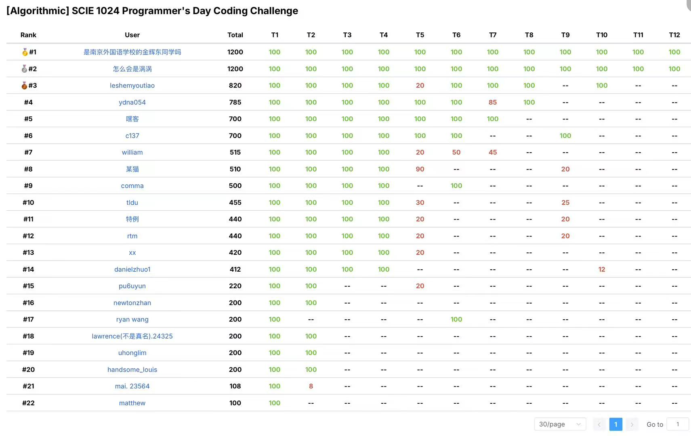
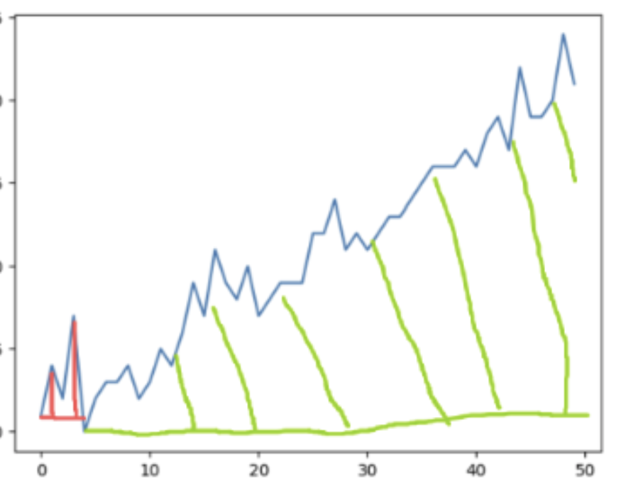
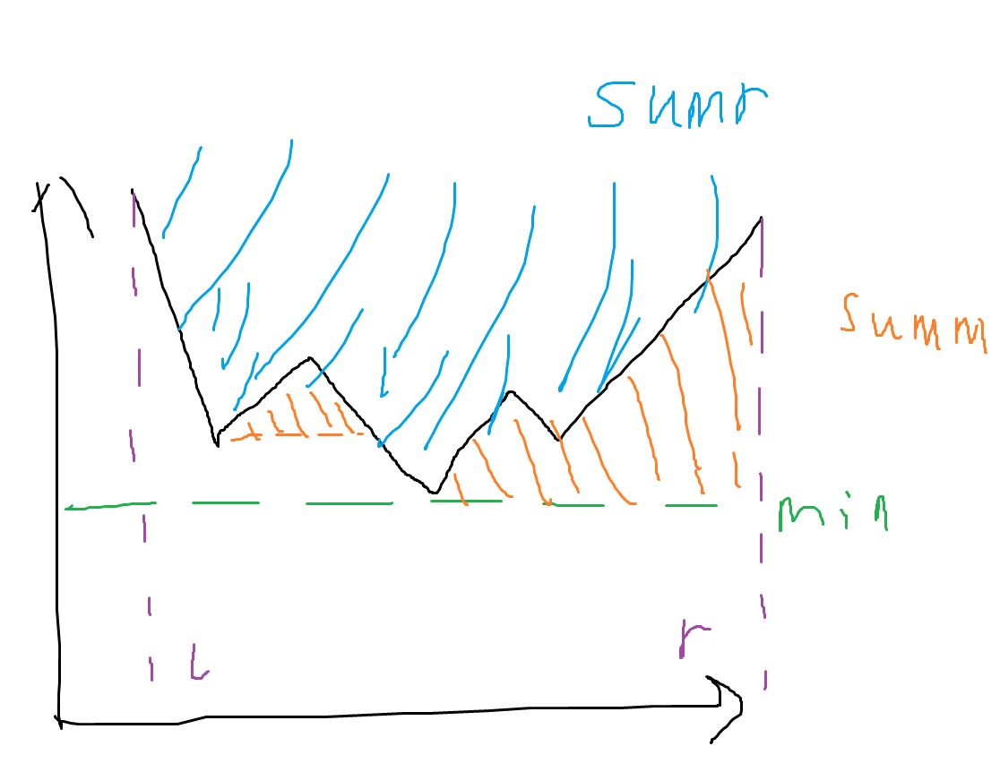
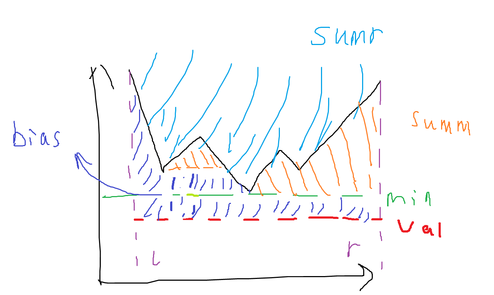
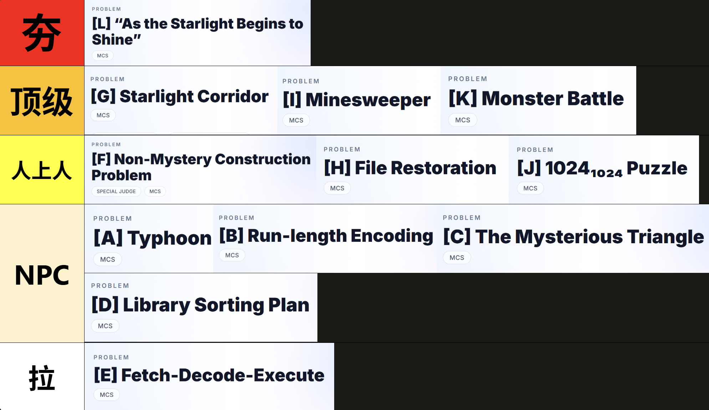

# 关于比赛

本届 SCIE 1024 程序员节活动由 M&CS Club 和 SCIE MLxAI 两个社团联合举办，设有两条赛道，算法和机器学习。我参加了算法的比赛，AK并取得了第二的成绩~



此次比赛从周五下午的八点开始，持续两天。可以说时间非常充足了

比赛题目pdf可 [点此处下载](/src/static/1024_Problem_Statements.pdf)

# 题目思路

以下是我的解题思路和对题目评价/吐槽（有些比较简单的就写得比较少）

Enjoy~

> CR(字典序) : Alex Liu, Allen Xu, Alvin, CQR, Tiger Shu

## A~D

水题略

## E (T5)

结合了课内FDE Cycle的模拟题，让人眼前一亮。但测试样例有点少，对于循环次数和报错 `CRASH` 的说明不够清晰，debug到自闭😭

## F (T6)

一道搜索题。用双向BFS优化了下速度，写了个简单的哈希表来标记已访问的图

```c++ title="T6.cpp" collapse={1-8, 19-116, 122-169, 171-181}
#include<bits/stdc++.h>
using namespace std;

struct grid{
    int grid[3][3];
    bool side;
};

int prime[9] = {2,3,5,7,11,13,17,19,23}; // Hash
int hash_grid(grid x){
    unsigned long long res = 0;
    for(int i=0;i<3;i++){
        for(int j=0;j<3;j++){
            res += prime[i*3+j]*x.grid[i][j];
        }
    }
    return res % 114514;
}

struct node{
    grid x;
    vector<int> o;
};

vector<node> visited[114514];
queue<node> ss, ee;

bool comp(grid a, grid b){
    bool res = false;
    for(int i=0;i<3;i++){
        for(int j=0;j<3;j++){
            if(a.grid[i][j] != b.grid[i][j])return false;
        }
    }
    return true;
}

bool searched(node x){
    int hashed = hash_grid(x.x);
    if(empty(visited[hashed]))return false;
    for(int i=0;i<visited[hashed].size();i++){
        if(comp(x.x, visited[hashed][i].x)){
            return true;
        }
    }
    return false;
}

node searched_grid(node x){
    int hashed = hash_grid(x.x);
    for(int i=0;i<visited[hashed].size();i++){
        if(comp(x.x, visited[hashed][i].x)){
            return visited[hashed][i];
        }
    }
}

void search(node x){
    visited[hash_grid(x.x)].push_back(x);
}

int step[4][2] = {{0,0},{0,1},{1,0},{1,1}};
node spin(node x, int opt){
    int i = step[opt][0];
    int j = step[opt][1];
    int cache = x.x.grid[i][j];
    x.x.grid[i][j] = x.x.grid[i+1][j];
    x.x.grid[i+1][j] = x.x.grid[i+1][j+1];
    x.x.grid[i+1][j+1] = x.x.grid[i][j+1];
    x.x.grid[i][j+1] = cache;
    return x;
}

node spinrev(node x, int opt){
    int i = step[opt][0];
    int j = step[opt][1];
    int cache = x.x.grid[i][j];
    x.x.grid[i][j] = x.x.grid[i][j+1];
    x.x.grid[i][j+1] = x.x.grid[i+1][j+1];
    x.x.grid[i+1][j+1] = x.x.grid[i+1][j];
    x.x.grid[i+1][j] = cache;
    return x;
}

void output_node(node x){
    cout<<x.x.side<<":";
    for(int i=0;i<x.o.size();i++)cout<<x.o[i]<<',';
    cout<<endl;
    for(int i=0;i<3;i++){
        for(int j=0;j<3;j++){
            cout<<x.x.grid[i][j]<<' ';
        }
        cout<<endl;
    }
    cout<<"-------"<<endl;
}

string code = "ABCDXXXXXX";
int main(){
    node start;
    for(int i=0;i<3;i++){
        for(int j=0;j<3;j++){
            start.x.grid[i][j] = i*3+j+1;
        }
    }
    start.x.side = true;

    node end;
    for(int i=0;i<3;i++){
        for(int j=0;j<3;j++){
            cin>>end.x.grid[i][j];
        }
    }
    end.x.side = false;
    ss.push(start);ee.push(end);

    vector<node> ans;
    bool STOP = false;
    int count = 0;

    while(!STOP){ // BFS
        node s_top = ss.front(); // From the start
        ss.pop();
        for(int opt=0;opt<4;opt++){
            node cc = spin(s_top, opt);
            cc.o = s_top.o;
            cc.o.push_back(opt);

            if(searched(cc)){
                node awa = searched_grid(cc);
                if(awa.x.side == true){ // Same side
                    continue;
                }else{ /////ANSWER!!
                    ans.push_back(cc);
                    ans.push_back(awa);
                    STOP = true;
                    break;
                }
            }
            search(cc);
            ss.push(cc);
        }
        
        if(STOP)break;

        node e_top = ee.front(); // From the end
        ee.pop();

        for(int opt=0;opt<4;opt++){
            node cc = spinrev(e_top, opt); // Spin in reverse direction
            cc.o = e_top.o;
            cc.o.push_back(opt);

            if(searched(cc)){
                node awa = searched_grid(cc);
                if(awa.x.side == false){ // Same side
                    continue;
                }else{ /////ANSWER!!
                    ans.push_back(awa);
                    ans.push_back(cc);
                    STOP = true;
                    break;
                }
            }
            search(cc);
            ee.push(cc);
        }

        if(STOP)break;
    }

    cout<<"YES"<<endl;
    for(int i=0;i<ans[0].o.size();i++){
        cout<<code[ans[0].o[i]];
    }
    for(int i=ans[1].o.size()-1;i>=0;i--){
        cout<<code[ans[1].o[i]];
    }
    cout<<endl;

    return 0;
}
```

## G (T7)

刚开始看到有图以为这也是一道搜索题，写了个深搜，TLE之后就去做别的题了。后面才发现其实有更巧妙的解法

考虑一个 $k$，使得所有边权包含 $2^k$ 的边可以**让起点和终点联通**（包含：指 $w\&2^k=1$ ）。那么，当 $k$ 取最大时，**最终答案的路径**一定取自这些包含 $2^k$ 的边。证明如下：

因为结果是按位与出来的，**不连通**就意味着**按位与后为0**，取不到这一位，所以答案一定不来自包含**大于** $2^k$ 的边。而如果答案来自包含**小于**$2^k$的边，那么它们所构成的答案肯定**不包含** $2^k$ ，就会比我们用包含 $2^k$ 的边所构建出的答案**更小**，不满足最大化

所以，我们可以从最高位往下找 $k$ 。每次找到一个可以让起点和终点联通的边时，**删除**其他所有的边，只**保留**包含 $2^k$ 的边。记录一路上符合条件的 $2^k$ 的和，我们就可以得到**最终的答案**

判断是否联通的话可以使用**并查集**。每次初始化后添加没有被删除的边，然后就可以判断起点和终点是否被联通

``` c++ title="T7.cpp" collapse={1-51} {57, 64}
#include<bits/stdc++.h>
using namespace std;
#define MAX 200009
#define int long long

int n, m;
int valid[MAX];

struct line{
    int from;
    int to;
    int val;
}lines[MAX];
int lines_tot;


void pushline(int a, int b, int val){
    lines[lines_tot].from = a;
    lines[lines_tot].to = b;
    lines[lines_tot].val = val;
    valid[lines_tot] = true;
    lines_tot++;
}

int bcj[MAX];

void bcj_init(){
    for(int j=0;j<=n;j++){
        bcj[j] = j;
    }
}

int bcj_find(int k){
    if(bcj[k] == k)return k;
    bcj[k] = bcj_find(bcj[k]);
    return bcj[k];
}

void bcj_merge(int a, int b){
    a = bcj_find(a); b = bcj_find(b);
    bcj[a] = b;
}

signed main(){ // n>300
    cin>>n>>m;
    for(int i=0;i<m;i++){
        int a,b,val;
        cin>>a>>b>>val;
        pushline(a,b,val);
    }

    int ans = 0;
    for(int k=30;k>=0;k--){
        bcj_init();
        for(int i=0;i<lines_tot;i++){
            if(valid[i]&&(lines[i].val & (1<<k))){
                bcj_merge(lines[i].from, lines[i].to);
            }
        }
        if(bcj_find(1) == bcj_find(n)){ // If available
            ans += (1<<k);
            for(int i=0;i<lines_tot;i++){
                if(!(lines[i].val & (1<<k))){
                    valid[i] = false; // Disable the edge
                }
            }
        }
    }
    cout<<ans;
    return 0;
}
```


## H (T8)

一道很板子的树形dp

对于每棵子树，我们都可以分为两种情况：它的祖先没有进行翻转和进行了翻转（翻转：指操作2，翻转子树）（如果偶数个祖先都翻转了，则视为没有翻转，奇数同理）。所以我们可以在每个节点维护两个值 `ans[0]` 和 `ans[1]` ，分别代表在它的祖先不翻转和翻转的情况下，这棵子树需要多少次操作才能让这个子树都变为正常

也就是说：

对于**叶子节点**来说，如果祖先没有翻转 `ans[0]` ，那么当它被损坏时操作次数为1，否则为0. 如果祖先翻转了 `ans[1]` ，那么就反过来

对于**非叶子节点**来说，我们可以分类讨论一下

记我自身的状态为 `status`（损坏为0，正常为1）,也就是说我没被祖先翻转的操作次数为 `!status` ，被翻转后的操作次数为 `status` ，则

- 祖先**没有翻转**（求 `ans[0]` ）：
  - 我**不翻转**，结果为我改变自己的操作次数 `!status` ，加上子节点们不翻转 `ans[0]` 的操作次数
  - 我**翻转**，结果为我翻转后改变自己的操作次数 `status` ，加上子节点们翻转 `ans[1]` 的操作次数，再加上我翻转产生的操作次数1
  - 最后， `ans[0]` 为两者的**最小值**
- 祖先**翻转**了（求 `ans[1]` ）：
  - 我**不翻转**，结果为祖先翻转后我改变自己的操作次数 `status` ，加上子节点们翻转 `ans[1]` 的操作次数
  - 我**翻转**，两个翻转产生的效果抵消，结果为我改变自己的操作次数 `!status` ，加上子节点们不翻转 `ans[0]` 的操作次数，再加上我翻转产生的操作次数1
  - 最后， `ans[1]` 为两者的**最小值**


后序遍历整个树，从下到上更新每个节点的`ans`，最后的答案就为根节点不翻转 `ans[0]` 和根节点翻转 `ans[1]` 加1的最小值

> Talk is cheap, show me the code.

```c++ title="T8.cpp" collapse={1-9, 29-41} {14-15, 26-27, 45}
#include<bits/stdc++.h>
using namespace std;
#define MAX 100009

struct node{
    vector<int> sons;
    int ans[2];
}tree[MAX];

bool status[MAX];
void dp(int k){
    // Leaf
    if(tree[k].sons.empty()){
        tree[k].ans[0] = !status[k];
        tree[k].ans[1] = status[k];
        return;
    }
    // Not Leaf
    int tot = 0;
    int tot_inv = 0;
    for(int i = 0; i < tree[k].sons.size(); i ++){
        dp(tree[k].sons[i]);
        tot += tree[tree[k].sons[i]].ans[0];
        tot_inv += tree[tree[k].sons[i]].ans[1];
    }
    tree[k].ans[0] = min(!status[k] + tot, status[k] + tot_inv + 1);
    tree[k].ans[1] = min(status[k] + tot_inv, !status[k] + tot + 1);
}

int main(){
    int n;
    cin>>n;
    for(int i = 1;i <= n; i++){
        cin>>status[i];
    }

    for(int i = 1; i < n; i ++){
        int a, b;
        cin>>a>>b;
        tree[a].sons.push_back(b);
    }

    dp(1);

    cout<<min(tree[1].ans[0], tree[1].ans[1]+1); // Answer
    return 0;
}
```

## I (T9)

3操作本质上是对x, y上的状态进行反转，总和不变

反转后原本的放置地雷变为删除地雷，删除地雷变为放置地雷。注意如果原本没有雷的情况下不能删除，有雷的情况下无法放置

而和的话，对于**放置**操作，则要添加这个雷周围的**空位**的数量，删除周围**雷**的数量（挡住了它的一个格子）。如果是**删除**的话，删除周围**空位**的数量后，也需要考虑周围**雷**的数量，重新加到和里面（释放一个格子给周围的雷）

对于雷的存储和查找，我维护了一个动态的二维数组。存储是线性复杂度，更常用的查找只有对数复杂度

注：`erfen` 指普通的二分，找不到返回-1。`kind_erfen` 指找到第一个大于此数的位置

``` c++ title="T9.cpp" collapse={1-68, 97-158} {77-78, 83, 92}
#include<bits/stdc++.h>
using namespace std;
#define ull unsigned long long
int n, m;
int x, y;
bool inverted = false;
bool current = false;
ull ans;

vector<int> dataa[1000009];
vector<bool> exists[1000009];

short erfen(int val, int row){ // return -1 if not found
    int mid;
    int l = 0, r = dataa[row].size();

    while(l<r){
        mid = (l+r)>>1;
        if(dataa[row][mid] >= val){
            r = mid;
        }
        else{
            l = mid + 1;
        }
    }
    if(l >= dataa[row].size() || dataa[row][l] != val){
        return -1;
    }
    return l;
}

short kind_erfen(int val, int row){ // return value greater than
    int mid;
    int l = 0, r = dataa[row].size();

    while(l<r){
        mid = (l+r)>>1;
        if(dataa[row][mid] >= val){
            r = mid;
        }
        else{
            l = mid + 1;
        }
    }
    return l;
}


bool valid(int x, int y){
    if(x<0||y<0||x>=n||y>=n)return false;
    return true;
}

bool query(int x, int y){
    if(!valid(x, y)){
        return false;
    }
    int pos = erfen(y, x);
    if(pos == -1){
        return false;
    }
    if(exists[x][pos] == false){
        return false;
    }
    return true;
    
}

void push(int x, int y){
    short pos = kind_erfen(y, x);
    dataa[x].push_back(0);
    exists[x].push_back(false);
    for(int i = dataa[x].size()-1; i > pos ; i--){
        dataa[x][i] = dataa[x][i-1];
        exists[x][i] = exists[x][i-1];
    }
    dataa[x][pos] = y;
    exists[x][pos] = true;
}

void pop(int x, int y){
    int pos = erfen(y, x);
    exists[x][pos] = false;
}

short step[8][2] = {{1,-1},{1,0},{1,1},{0,-1},{0,1},{-1,-1},{-1,0},{-1,1}};
void contribute(int x, int y){
    for(int k=0;k<8;k++){
        x += step[k][0]; y += step[k][1];
        if(valid(x, y)){
            bool ouo = query(x, y);
            ans += (!query(x, y))*(current?-1:1) + (query(x, y))*(current?1:-1);
        }
        x -= step[k][0]; y -= step[k][1];
    }
}

void rr(int x, int y){
    if(current){
        pop(x, y);
    }
    else{
        push(x, y);
    }
    contribute(x, y);
}

inline void add(int x, int y){
    current = query(x, y);
    if(inverted && !current || !inverted && current){
        return; // No change
    }
    rr(x, y);
}

inline void remove(int x, int y){
    current = query(x, y);
    if(inverted && current || !inverted && !current){
        return; // No change
    }
    rr(x, y);
}

inline void reverse(int x, int y){
    current = query(x, y);
    rr(x, y);
}

int main(){
    cin>>n>>m;
    while(m--){
        int opt;
        cin>>opt;
        switch (opt){
            case 1:{
                cin>>x>>y;
                x--;y--;
                add(x, y);
            }break;
            case 2:{
                cin>>x>>y;
                x--;y--;
                remove(x, y);
            }break;
            case 3:{
                cin>>x>>y;
                x--;y--;
                inverted = !inverted;
                reverse(x, y);
            }break;
            case 4:{
                cout<<ans<<endl;
            }break;
            default:break;
        }
    }
    return 0;
}
```

## J (T10)

博弈论，在 $m \geq 32$ 后开始以八行为一组循环。有一个20以后的组合比较难想，最后写了个模拟把这个爆出来了

不过多评价，这种题就要享受自己构建可行方案解题的乐趣（嗯嗯）

```c++ title="T10.cpp" {4, 12}
#include<bits/stdc++.h>
using namespace std;
#define int long long
int remainder[9] = {0, 0, 0, 4, 4, 4, 6, 7};

signed main(){
    int T;
    cin>>T;
    while(T--){
        int a;
        cin>>a;
        cout<<(remainder[a%8] + (a / 8) * 4  - 2*(a%8==7&&a>10) - (a>=30&&a%8==6))<<endl;
    }
    return 0;
}
```

## K (T11)

从第 `i` 堆卡牌中进行 `j` 次抽取操作所贡献的能力值相当于求出从 1 到 `j+1` 的**和**并减去其中的**最小值**。所以我们可以预先计算出这个贡献的能力值 `chooce[i][j]`

从第一堆卡牌开始，考虑从第0堆到第 `i` 堆中抽取 `card` 个卡片可以取得的最大能力值 `dp[i][card]` 。我们在第 `i` 堆拿 `num` 个卡片，在第 0 到 `i-1` 堆拿 `card-num` 个卡片的话，所产生的能力值就为 `dp[i-1][card-num] + choose[i][num]`。从0到n-1动态规划，答案为 `dp[n-1][...]` 中的最大值

```c++ title="T11.cpp" collapse={1-10, 36-43} {20, 32}
#include<bits/stdc++.h>
using namespace std;
#define int unsigned long long
int n, m, k;
int datas[300][3000];
int choose[300][3000];
int dp[300][3000];
signed main(){
    cin>>n>>m>>k;
    
    for(int i=0;i<n;i++){
        int min_val = 114514;
        int tot = 0;
        for(int j=0;j<m;j++){
            cin>>datas[i][j];
            min_val = min(datas[i][j], min_val);
            tot += datas[i][j];

            if(j>=1)
            choose[i][j] = tot - min_val;
            dp[i][j] = choose[i][j];
            if(j==m-1){
                choose[i][m] = tot;
                dp[i][m] = tot;
            }
        }
    }

    for(int i = 1; i < n;i++){
        for(int card = 0; card <= k; card ++){
            for(int num = 0; num <= card && num <= m; num ++){
                dp[i][card] = max(dp[i-1][card-num]+choose[i][num], dp[i][card]);
            }
        }
    }

    int res=0;
    for(int i=0;i<=k;i++){
        res = max(res, dp[n-1][i]);
    }
    cout<<res<<endl;
    return 0;
}
```

## L (T12)

乍一看好像没什么头绪，我们可以一步一步分析

### Step 1

如果题目的数据都是单调递增的话就很好了，所有的类型2的结果都是0。但如果数据有一段**递减**的段落的话，我们希望它通过**最少次数的翻倍操作**达成单调不递减。那么它所达成的单调不递减序列中一个元素一定在**前一个元素**到**其两倍**的范围之内，也就是说 $a_{i-1} \leq a_{i} < 2a_{i-1}$。这样的数组称为**平滑的**

对于一个数组 `a` ，我们可以事先就构建出一个描述每个元素需要乘多少次2才能让整个数组 `a` **平滑**的数组 `b`，之后每次查询的时候只用把每个元素所需要的次数 `b[i]` 相加就可以了

翻倍操作相当于减少这个元素所需要的翻倍次数，所以就把对应的 `b` 减去一

这是我刚开始的想法， ~~但第二个测试数据没过（。~~ 后来发现虽然平滑的序列一定单调不递减，但单调不递减的序列**不一定**平滑。换句话说，我们可以用比构造平滑序列**更少**的次数来让序列不递减

我们会发现，一个递增的序列（也就是 `b` 递减）不需要参与计算。也就是说，我们要刨除序列中 `b` 递减的部分，只保留增长的部分。于是，我们可以从头开始记录 `b[l]` 到 `b[i]` 的最小值。用当前的 `b[i]` 剪掉这个最小值，得到的差累加起来就是最终的答案。图形化表示就是这样的：



我可能说的有一点绕（逃）。Anyway，在这里附上出题人 `Allen` 大佬更为严谨的证明过程 (=^^) /

> 为了方便计数，我们定义第 $i$ 个数乘2的次数为 $e_i \in \mathbb{Z}_{\geq 0}$
>
> 询问的目标是
>
> $$
> \min \sum^r_{i=l+1}e_i \quad \mathrm{s.t.} \quad a_i \times 2^{e_i} \leq a_{i+1} \times 2^{e_{i+1}} \quad  (\forall i \in [l, r-1])
> $$
>
> 把相邻约束用指数差线性化。定义
>
> $$
> c_i = \left\lceil \log_2 \frac{a_i}{a_{i-1}} \right\rceil \in \mathbb{Z} \quad (i \in [2, n])
> $$
>
> 则
>
> $$
> a_i \times 2^{e_i} \leq a_{i+1} \times 2^{e_{i+1}} \Leftrightarrow e_{i+1} - e_i \geq c_i 
> $$
>
> 于是目标函数可被重写为
>
> $$
> \min \sum^r_{i=l+1} e_i \quad \mathrm{s.t.} \quad e_{i+1} - e_{i} \geq c_i, \quad e_i \geq 0
> $$
>
> 令前缀和
>
> $$
> b_k = \sum^k_{i=1} c_i
> $$
>
> 容易得到我们最后的结论
>
> $$
> \mathrm{Ans} (l, r) = \sum^r_{k=l+1} \left( b_k - \min_{t \in [l+1, k]} b_t \right)
> $$
>
> （略有改动）

他的结论最小值是从 `l+1` 开始算，而我的是从 `l` 开始算。~~不过我也懒得推为什么了大概意思差不多~~

**总之！** 我们现在只需要算出每个元素 $b_i$ 减去它之前元素的最小值 $\min b_k, \enspace l\leq k<i$ 的和就可以了。

### Step 2

剩下的话，我开了一个线段树维护 $b$ 的从 $l$ 到 $r$ 的**最小值** `min`，**和** `sumr` 还有**答案** `summ` ，类似于这样：



~~（灵魂画手）~~

最小值和总和的线段树求解比较简单就不赘述了。`summ` 的意思是在此区间进行查询操作 `2` 所返回的结果

如果它的查询区间正好和线段树的区间重合，那就很简单了，直接返回 `summ` ，如果没有，我们需要把这些答案累加起来，并加上一个**偏移**

**偏移**为当区间左侧的最小值是 `val` 的时候本区间还需要加多少操作次数，由 `bias()` 这个函数求出。他会找到 `val` 与这个区间的交点，并用 `(r-l+1)*val` 的长方形剪掉 `summ` 和 `sumr` 的面积（也就是蓝色和橙色的面积），从而求得图中深蓝色的 `bias`



查询操作或者 `summ` 的更新就是靠计算偏移来进行的。用**左边区间的最小值**给**右边区间**做偏移，最后汇总得到答案

求偏移的时间复杂度是一个 $\log$，再算上查询的 $\log$，总的时间复杂度为 $O(n\log^2 n)$


这道题算是这两年1024比赛最难的了（）非常考验选手对问题进行抽象概括，识别pattern，考虑边界情况，最终代码实现的能力 :spoiler[ （出题组太强了呜呜呜） ]

以及代码：

```c++ title="T12.cpp" collapse={1-31, 47-95, 120-161}
#include<bits/stdc++.h>
using namespace std;

#define int long long
#define inf 9223372036854775807
#define ls treee[k].lson
#define rs treee[k].rson
#define mid ((l+r)>>1)
#define MAX 100009

int n,q,a[MAX];
int b[MAX];

struct node{
    int lson, rson;
    int minn, summ;
    int sumr;
}treee[2*MAX];
int ttop;


int inittree(int l, int r){
    ttop++;
    int k = ttop;
    if(l==r)return k;
    ls = inittree(l,mid);
    rs = inittree(mid+1, r);
    return k;
}


int bias(int k, int l, int r, int val){
    if(l==r){
        return (treee[k].minn >= val) ? (treee[k].minn - val) : 0;
    }
    if(treee[k].minn >= val){
        return (treee[k].sumr - treee[k].summ) - (r-l+1)*val;
    }
    if(treee[ls].minn <= val){
        int bb = bias(ls, l, mid, val);
        return bb ;
    }else{
        int aa = (treee[ls].sumr - treee[ls].summ) - (mid-l+1)*val + bias(rs, mid+1, r, val) - bias(rs, mid+1, r, treee[ls].minn);
        return aa;
    }
}

void buildtree(int k, int l, int r){
    if(l==r){
        treee[k].minn = b[l];
        treee[k].sumr = b[l];
        return;
    }
    buildtree(ls, l, mid);
    buildtree(rs, mid+1, r);
    
    treee[k].minn = min(treee[ls].minn, treee[rs].minn);
    treee[k].summ = treee[ls].summ + treee[rs].summ;
    treee[k].sumr = treee[ls].sumr + treee[rs].sumr;
    treee[k].summ += bias(rs, mid+1, r, treee[ls].minn);
}

void printtree(int k, int l, int r){
    cout<<"---"<<endl;
    cout<<k<<','<<l<<','<<r<<endl;
    cout<<treee[k].minn<<','<<treee[k].sumr<<','<<treee[k].summ<<endl;
    cout<<"---"<<endl;
    if(l!=r){
        printtree(ls, l, mid);
        printtree(rs, mid+1, r);
    }
}

void minuss(int k, int l, int r, int pos){
    if(pos < l || pos > r){
        return;
    }
    if(l==r){
        treee[k].minn--;
        treee[k].sumr--;
        return;
    }
    minuss(treee[k].lson, l, mid, pos);
    minuss(treee[k].rson, mid+1, r, pos);
    
    treee[k].minn = min(treee[ls].minn, treee[rs].minn);
    treee[k].summ = treee[ls].summ + treee[rs].summ;
    treee[k].sumr = treee[ls].sumr + treee[rs].sumr;
    treee[k].summ += bias(rs, mid+1, r, treee[ls].minn);
}

struct query_node{
    int minn, summ;
};

query_node querysum(int k, int l, int r, int ll, int rr, int bb){
    if(l > rr || r < ll){
        query_node res;
        res.minn = bb;
        res.summ = 0;
        return res;
    }
    if(l >= ll && r <= rr){
        query_node res;
        res.minn = min(bb, treee[k].minn);
        res.summ = treee[k].summ;
        if(bb != inf){
            res.summ += bias(k, l, r, bb);
        }
        return res;
    }
    query_node lres = querysum(ls, l, mid, ll, rr, bb);
    query_node rres = querysum(rs, mid+1, r, ll, rr, min(bb, lres.minn));
    query_node res;
    res.minn = min(bb, rres.minn);
    res.minn = min(res.minn, lres.minn);
    res.summ = lres.summ + rres.summ;
    return res;
}

signed main(){
    cin>>n>>q;
    inittree(1, n);
    for(int i=1;i<=n;i++){
        cin>>a[i];
    }

    b[1] = 0;
    for(int i=2;i<=n;i++){
        b[i] = b[i-1];
        if(a[i] > a[i-1]){
            int ovo = 0;
            while(a[i-1] * (1<<ovo) <= a[i]){ ovo++;}
            ovo--;
            b[i] -= ovo;
        }
        else if(a[i] < a[i-1]){
            int ovo = 0;
            while(a[i] * (1<<ovo) < a[i-1]) ovo++;
            b[i] += ovo;
        }
    }

    buildtree(1, 1, n);
    while(q--){
        int opt;
        cin>>opt;
        if(opt == 1){
            int pos;
            cin>>pos;
            minuss(1,1,n,pos);
        }else{
            int l, r;
            cin>>l>>r;
            query_node result = querysum(1,1,n,l,r,inf);
            cout<<result.summ<<endl;
        }
    }
    
    return 0;
}
```

# 从夯到拉

最近从夯到拉的排名很火，于是：



主要依据是题目的思维跳跃度/难易度，野榜，仅代表个人的偏好，不喜轻喷（


# 题外话

2024的Coding Challenge活到了第二天的下午，这次第一名的大佬熬到第二天凌晨6点左右就完赛了，:spoiler[快进到2026年的1024比赛开赛当天就被AK]

主播这次就比较摆了，磨蹭到结束前两个小时才写完

每次打OI竞赛的时候都很感慨自己当初为什么不在体制内继续学信息学奥赛（哭）

总之非常感谢出题组的付出，使这个活动延续下去，也提供了一个认识各位大佬的平台~
