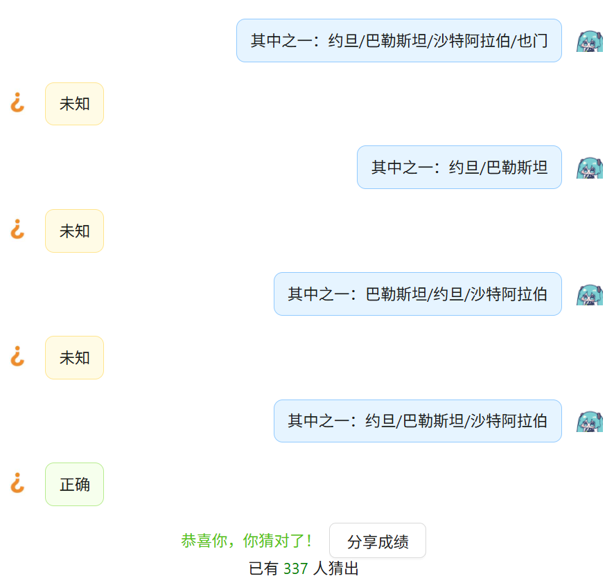
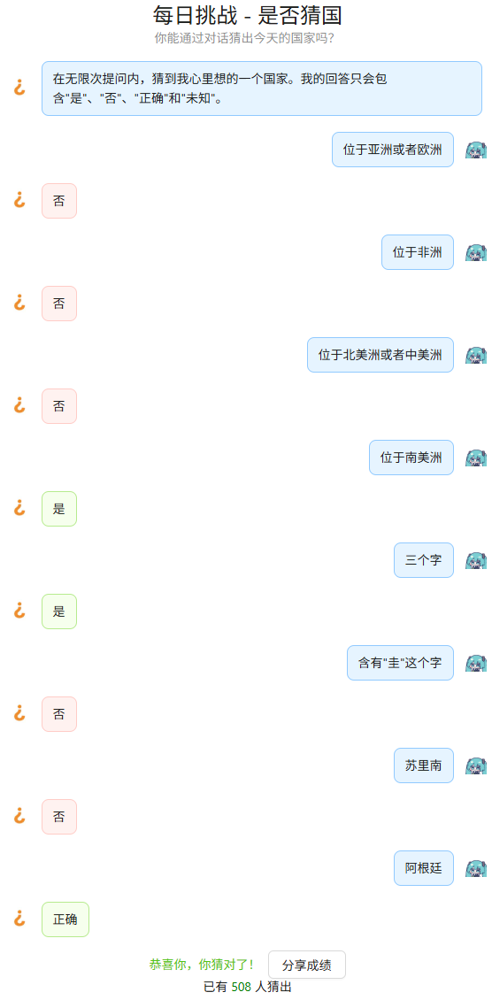

# 前言

**猜**盐猜**盐**猜盐**猜**盐猜**盐**

最近沉迷猜盐无法自拔。做是否猜国的时候~~作为一名蒟蒻OIer~~一下就想到了可以用二分来最小化最大提问次数，遂写此文。

> 声明：本文所指的国家来源为猜盐上的[世界上的国家](https://xiaoce.fun/q/5266)，仅作为“是否猜国”的参考用，不代表本站任何立场。

# 理论

**问题描述**：在是否猜国中，你需要通过提出问题猜测一个国家，而AI会回答这个问题对于这个国家是正确的还是错误的（或者未知）。你也可以直接提出这个国家的名字。如果名字正确则直接结束。也就是说，一次对话有四个结果：是、否、正确和未知。

本文只讨论**是或否**的情况。

（我试过在一次对话里面塞两个问题去利用正确和未知这两个状态来减少提问次数，可是不是很稳定。所以我们只讨论是否两种情况）

注意到，对于n个对象二分的最大次数$T$ 为

$$
T=\lceil \log_2 n \rceil
$$

对197个国家进行二分的最大次数为 $\lceil \log_2 197 \rceil = 8$ 次。

由于猜盐最后一次“正确”也算在次数内，所以实际上二分的**最大提问数为9次**。

# 二分方法

根据以上的理论，我构建了一个可行的二分猜国的规则。

为了简洁性，以下的树只列出了**前五个问题**，把国家的范围缩小到8个以内。读者可以自行找出对剩下的国家进行二分的方法，或者直接复制一半的国家问AI答案在不在这里面。

任何**错误/更优雅的方法**也请各位评论指出{{{(>_<)}}}

**我们开始吧！(=^^)///**

---

- **亚欧 (92)**
  - **大部分国土位于亚洲（包括俄罗斯） (49)**
    - **中/西亚 (23)**
      - **阿拉伯国家 (12)**
        - **三个字 (6)**
          ：*伊拉克/科威特/黎巴嫩/阿联酋/卡塔尔/叙利亚*
        - **非三个字 (6)**
          ：*约旦/巴勒斯坦/沙特阿拉伯/也门/阿曼/巴林*
      - **不是阿拉伯国家 (11)**
        - **中亚(5)**
          ：*哈萨克斯坦/塔吉克斯坦/乌兹别克斯坦/吉尔吉斯斯坦/土库曼斯坦*
        - **西亚(6)**
          ：*以色列/土耳其/塞浦路斯/格鲁吉亚/亚美尼亚/阿塞拜疆*
    - **东/东南/南/北亚(26)**
      - **东南亚 (11)**
        - **两个字（不包括印尼）(5)**
          ：*缅甸/老挝/越南/泰国/文莱*
        - **两个字以上（包括印度尼西亚）(6)**
          ：*柬埔寨/印度尼西亚/马来西亚/东帝汶/菲律宾/新加坡*
      - **东/南/北亚 (15)**
        - **两个字 (8)**
          ：*中国/蒙古/朝鲜/韩国/日本/伊朗/印度/不丹*
        - **三个字及以上 (7)**
          ：*斯里兰卡/马尔代夫/巴基斯坦/孟加拉国/尼泊尔/阿富汗/俄罗斯*
  - **大部分国土位于欧洲（不包括俄罗斯）(43)**
    - **欧盟(27)**
      - **名字结尾为牙/亚/兰/利 (15)**
        - **名字结尾为牙/亚(8)**
        ：*西班牙/葡萄牙/斯洛文尼亚/克罗地亚/罗马尼亚/保加利亚/爱沙尼亚/拉脱维亚*
        - **名字结尾为兰/利(7)**
        ：*荷兰/波兰/芬兰/爱尔兰/意大利/匈牙利/奥地利 *
      - **名字结尾不为以上的字 (12)**
        - **两个字 (6)**
        ：*捷克/丹麦/希腊/瑞典/德国/法国*
        - **三或四个字 (6)**
        ：*比利时/卢森堡/马耳他/立陶宛/斯洛伐克/塞浦路斯*
    - **非欧盟(16)**
      - **巴尔干半岛/东欧(8)**
        ：*塞尔维亚/北马其顿/波黑/黑山/阿尔巴尼亚/白俄罗斯/乌克兰/摩尔多瓦*
      - **非巴尔干半岛/东欧(8)**
        ：*冰岛/英国/挪威/瑞士/安道尔/列支敦士登/圣马力诺/梵蒂冈*
- **非亚欧(105)**
  - **非洲(54)**
    - **北/东部非洲 (24)**
      - **阿拉伯国家联盟成员国 (9)**
        - **三个字 (6)**
          ：*利比亚/摩洛哥/突尼斯/吉布提/索马里/科摩罗*
        - **非三个字(3)**
          ：*阿尔及利亚/埃及/苏丹*
      - **非阿拉伯国家联盟成员国 (15)**
        - **三个字 (8)**
          ：*肯尼亚/乌干达/卢旺达/布隆迪/赞比亚/马拉维/南苏丹/塞舌尔*
        - **非三个字 (7)**
          ：*埃塞俄比亚/厄立特里亚/马达加斯加/坦桑尼亚/津巴布韦/毛里求斯/莫桑比克*
    - **中/西/南部非洲 (30)**
      - **西部非洲(16)**
        - **两/三个字 (8)**
          ：*马里/加纳/多哥/贝宁/尼日尔/佛得角/几内亚/冈比亚*
        - **四/五个字 (8)**
          ：*塞内加尔/塞拉利昂/利比里亚/科特迪瓦/尼日利亚/几内亚比绍/布基纳法索/毛里塔尼亚*
      - **中/南部非洲(14)**
        - **两/四个字 (7)**
          ：*乍得/中非/加蓬/南非/纳米比亚/博茨瓦纳/斯威士兰*
        - **非两/四个字(7)**
          ：*莱索托/刚果金/刚果布/安哥拉/喀麦隆/赤道几内亚/圣多美和普林西比*
  - **南北美/大洋 (51)**
    - **北/中美洲（包括巴拿马）(23)**
      - **岛国 (13)**
        - **四个字 (5)**
          ：*多米尼加/多米尼克/圣卢西亚/巴巴多斯/格林纳达*
        - **非四个字 (8)**
          ：*古巴/海地/牙买加/巴哈马/圣基茨和尼维斯/安提瓜和巴布达/圣文森特和格林纳丁斯/特立尼达和多巴哥*
      - **非岛国 (10)**
        - **两/三个字 (5)**
          ：*美国/加拿大/墨西哥/伯利兹/巴拿马*
        - **四/五个字 (5)**
          ：*危地马拉/萨尔瓦多/洪都拉斯/尼加拉瓜/哥斯达黎加*
    - **南美洲/大洋洲 (28)**
      - **南美（不包括巴拿马）(12)**
        - **三个字 (5)**
          ：*阿根廷/苏里南/乌拉圭/巴拉圭/圭亚那*
        - **二/四个字 (7)**
          ：*巴西/智利/秘鲁/委内瑞拉/哥伦比亚/厄瓜多尔/玻利维亚*
      - **大洋(16)**
        - **二/三个字 (8)**
          ：*帕劳/斐济/汤加/瑙鲁/纽埃/图瓦卢/萨摩亚/新西兰*
        - **四个字及以上 (8)**
          ：*澳大利亚/巴布亚新几内亚/密克罗尼西亚联邦/马绍尔群岛/基里巴斯/所罗门群岛/瓦努阿图/库克群岛*

> **注**
>
> **地理区划原则**：联合国地理区划
>
> 所以伊朗和阿富汗属于**南亚**
>
> **名字**：国家常用称呼
>
> 法兰西第五共和国❌ 法国✅

有的时候猜盐的判定很谜，所以实际运用这个方法的时候可能会比最优解更少或者更多。

实战：

